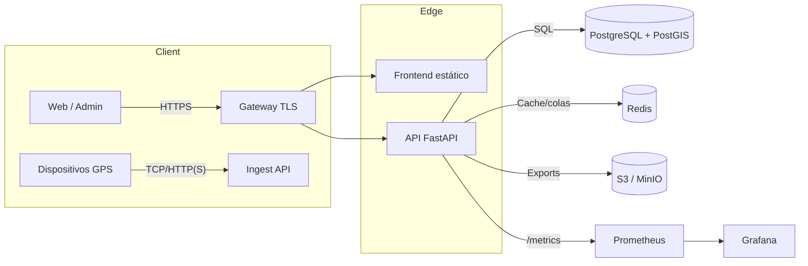
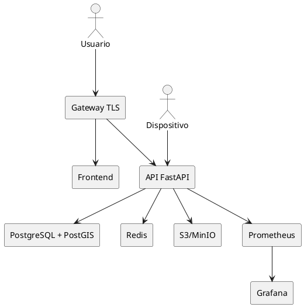
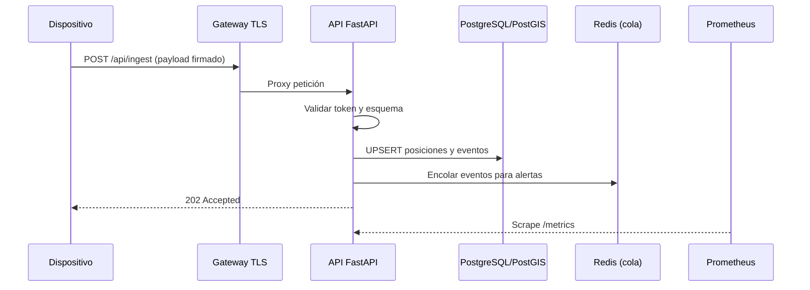
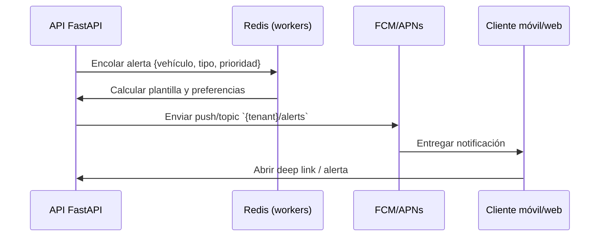

# Guía de arquitectura y flujos de datos

Este documento resume la arquitectura de GPS Tracker, sus dependencias y los flujos de datos principales para despliegue y operación.

## Componentes principales
- **Gateway HTTPS (Nginx)**: termina TLS, sirve el frontend estático y enruta `/api/*` hacia la API FastAPI.
- **Frontend**: bundle estático generado por la app web; se publica tras el gateway.
- **API (FastAPI)**: expone REST/WS, autentica usuarios y normaliza datos de dispositivos.
- **Base de datos (PostgreSQL + PostGIS)**: almacena usuarios, vehículos, dispositivos, posiciones y eventos geoespaciales.
- **Redis**: cachea sesiones y soporta colas de procesado para ingestión/alertas.
- **Almacenamiento de archivos (S3 compatible)**: opcional para exportaciones y respaldos.
- **Observabilidad**: Prometheus scrapea la API y Grafana grafica métricas; logs estructurados se envían a stdout o a un shipper centralizado.

## Diagrama de arquitectura

Alternativa PlantUML (útil para pipelines que renderizan `.puml`):

## Dependencias y requisitos
- **Runtime**: Docker/Docker Compose o Kubernetes (Helm/kustomize) con soporte para redes internas y volúmenes persistentes.
- **Certificados TLS**: claves en `deployments/gateway/certs` para entornos locales o integraciones con ACME/Let’s Encrypt en entornos reales.
- **Variables de entorno**: `DATABASE_URL`, `REDIS_URL`, `JWT_SECRET`, `MAP_PROVIDER`/`MAPBOX_TOKEN`, credenciales S3 y claves de notificación (FCM/APNs).
- **Puertos**: 8443 (gateway TLS), 8000 (API), 3000 (Grafana), 9090 (Prometheus), 5432 (PostgreSQL), 6379 (Redis).

## Flujos de datos
### Ingesta de posiciones y eventos
- Los dispositivos envían posiciones en lote o streaming (HTTP/WS). 
- El gateway deriva `/api/ingest` directamente a la API.
- La API valida firma/token del dispositivo, normaliza coordenadas y las escribe en PostgreSQL; simultáneamente encola eventos en Redis para cálculo de alertas.
- Las alertas calculadas publican notificaciones push y generan métricas de negocio.

### Consultas de usuarios
- El frontend consume `/api/vehicles`, `/api/positions` o WebSocket `/api/ws/positions` con JWT firmado.
- La API aplica filtros geoespaciales (PostGIS) y caching de respuestas recientes en Redis para dashboards.
- Los resultados se renderizan en el mapa y se almacenan en caché local del navegador para minimizar solicitudes repetidas.

### Observabilidad
- Prometheus scrapea `/metrics` de la API y `http://db:9187/metrics` si se habilita el exporter de PostgreSQL.
- Grafana usa Prometheus como datasource y puede enriquecer dashboards con logs provenientes del gateway o un shipper (Fluent Bit/Filebeat).

## Diagramas de secuencia
### Ingesta

### Notificaciones

